# Helioskrill: End-to-End Space-Temporal Trajectory Planning with Vision Mamba (ViM) & Sensor Fusion

[](https://pytorch.org/)
[](https://github.com/state-spaces/mamba)
[](https://carla.org/)
[](LICENSE)

---

## 1. Visión General del Proyecto

* **Objetivo:** Exploración e implementación de una canalización de extremo a extremo (*End-to-End*) para la planificación de trayectorias en conducción autónoma. El sistema combina una arquitectura visual bidireccional basada en **Vision Mamba (ViM)**, recurrencia temporal espacio-temporal con **Temporal Mamba**, y fusión de sensores en vista de pájaro (**Camera IPM + LiDAR BEV**).
* **Stack Tecnológico:** PyTorch, Mamba-SSM, CUDA, OpenCV, TensorBoard, CARLA Simulator API.

---

## 2. Arquitectura del Sistema

### Flujo de Tensores End-to-End

El modelo procesa secuencias de tiempo $S=5$ provenientes de un arreglo de 8 cámaras RGB de perspectiva de alta definición y una nube de puntos LiDAR convertida a una grilla BEV de 5 canales:

```mermaid
graph LR
    A["8 Cámaras RGB [B, S, 8, 3, H, W]"] --> B["Vision Mamba (ViM 2D)"]
    B --> C["Features 2D [B*S*8, C, H', W']"]
    C --> D["Inverse Perspective Mapping (IPM)"]
    D --> E["Plano BEV Cámara [B, S, C, H_bev, W_bev]"]
    E --> F["Temporal Mamba (SSM 1D)"]
    F --> G["Fusión con LiDAR BEV [B, C_fused, H_bev, W_bev]"]
    G --> H["BEV Planning Head"]
    H --> I["10 Waypoints Futuros [B, 10, 4]"]
```



#### Descripción por Bloques:
1. **Vision Mamba 2D Encoder:** Extrae características de textura y contexto espacial de las 8 vistas periféricas de forma bidireccional usando SSMs (*State Space Models*) en lugar de atención cuadrática.
2. **Geometría BEV via IPM:** Proyecta las características 2D a un espacio tridimensional de vista de pájaro ($400 \times 400$ a resolución de $0.25\text{m/pixel}$) guiado por las matrices extrínsecas $E$ e intrínsecas $K$ de cada cámara.
3. **Temporal Mamba:** Recorre secuencialmente la dimensión temporal $S$ píxel a píxel sobre la grilla BEV para estimar velocidad y dirección de movimiento.
4. **Fusion Neck & Planning Head:** Concatena las características BEV de cámara y el tensor estadístico de LiDAR ($Z_{\max}, Z_{\text{diff}}, Z_{\text{mean}}$, densidad e intensidad) para regresar los 10 waypoints futuros en coordenadas relativas del vehículo (`rel_x`, `rel_y`, `rel_z`, `rel_yaw`).

---

## 3. Resultados y Diagnóstico Técnico (El Post-Mortem)

En la ciencia y la ingeniería de IA rigurosa, documentar las fallas y cuellos de botella de convergencia es tan importante como celebrar los éxitos. A continuación se detallan los hallazgos analíticos obtenidos al entrenar la arquitectura desde cero (*from scratch*):

### Problema 1: Cold-Start en Mamba Visual (*Training from Scratch*)
* **Diagnóstico:** Entrenar un encoder visual `VisionMambaEncoder` desde cero con una muestra limitada ($\sim 2,300$ secuencias temporales) no proporciona suficientes primitivas visuales ni invariancias espaciales (bordes, profundidades, relaciones de aspecto).
* **Impacto:** Al no haber convergido los filtros 2D básicos, las características proyectadas al plano 3D mediante IPM resultaron ruidosas, impidiendo que la cabeza de planificación asociara patrones visuales con trayectorias reales.

### Problema 2: Inestabilidad Estocástica de `BatchNorm2d` con Lote Pequeño ($B = 1$)
* **Diagnóstico:** Debido a las restricciones de VRAM al procesar $5 \text{ frames} \times 8 \text{ cámaras} = 40 \text{ imágenes}$ por iteración, el tamaño de lote efectivo por GPU tuvo que fijarse en $B = 1$ (combinado con acumulación de gradiente).
* **Impacto:** Las estadísticas móviles de Batch Normalization (`running_mean` y `running_var`) sufrieron una alta deriva estocástica entre iteraciones, provocando curvas de pérdida de validación oscilatorias en forma de **"diente de sierra"**.

### Problema 3: Error de Envoltura Angular (*Wrap-Around*) en las Métricas de Yaw
* **Diagnóstico:** Durante la evaluación de la métrica angular (`yaw_error_deg`), se detectaron picos artificiales en los errores cuando el ángulo de la trayectoria cruzaba la frontera discontinua de $+180^\circ$ a $-180^\circ$ (o $+\pi$ a $-\pi$).
* **Impacto:** Un error real de $2^\circ$ (ej. de $+179^\circ$ a $-179^\circ$) se calculaba numéricamente como un error masivo de $358^\circ$, distorsionando el promedio de la métrica de orientación.

---

## 4. Lecciones Aprendidas y Siguiente Iteración

### Pivote Estratégico: De *Scratch Training* a *Fine-Tuning con LoRA / PEFT*

Los resultados empíricos demuestran de manera contundente que **los encoders visuales de conducción autónoma no deben entrenarse desde cero** en conjuntos de datos de tamaño modesto.

#### Hoja de Ruta para la Versión 2.0:
1. **Backbones Pre-entrenados:** Sustituir la extracción desde cero por características congeladas o afinadas de modelos pre-entrenados a gran escala (ej. **ResNet50 / DINOv2 / nuScenes Checkpoints**).
2. **Adaptación Eficiente de Parámetros (LoRA):** Incorporar módulos **LoRA** (*Low-Rank Adaptation*) en los bloques Mamba espaciales y temporales para permitir un aprendizaje de baja huella de memoria sin desestabilizar los pesos pre-entrenados.
3. **Sustitución de Normalización:** Reemplazar las capas de `BatchNorm2d` por `GroupNorm` o `LayerNorm` para garantizar estabilidad matemática estricta independiente del tamaño de lote ($B=1$).
4. **Pérdida Coseno para Ángulos:** Reformular la pérdida y métrica angular de Yaw utilizando funciones trigonométricas ($\sin(\Delta \theta), \cos(\Delta \theta)$) para eliminar los errores de envoltura en $\pm 180^\circ$.

---

## 5. Estructura del Proyecto

```text
Helioskrill_vim_train/
├── models/
│   ├── modules/
│   │   ├── BEV_perception.py      # Red principal ViM + Temporal Mamba + Fusion
│   │   ├── BEV_planning.py        # Cabeza de regresión de waypoints
│   │   └── BEV_sensors.py         # Filtro de Kalman Extendido (EKF telemetry)
│   └── utils/
│       ├── blocks.py              # Implementación de MambaBlock y TemporalMamba
│       └── carla_data_collector.py # Recolector de datos multi-sensor en CARLA
├── scripts/
│   ├── train_vim.py               # Pipeline de entrenamiento optimizado (AMP + Resume)
│   ├── evaluate_visualization.py  # Script de evaluación cruzada y gráficos BEV
│   └── preprocess_dataset.py      # Pre-procesador paralelo de imágenes
├── reproducibility_exp1.md        # Especificación técnica del Experimento 1
├── .gitignore                      # Filtros de datos, checkpoints y logs
└── README.md                       # Documentación principal del proyecto
```

---

## 6. Reproducibilidad

Para reproducir los experimentos o ejecutar la evaluación visual:

```bash
# 1. Preprocesar imágenes (Opcional)
python3 scripts/preprocess_dataset.py --resize_factor 0.5

# 2. Reanudar o entrenar el modelo
python3 scripts/train_vim.py --batch_size 1 --accumulation_steps 8 --resume

# 3. Generar visualizaciones y métricas de validación
python3 scripts/evaluate_visualization.py --checkpoint checkpoints/experimento_1/best_model.pth
```
