# Helioskrill: End-to-End Space-Temporal Trajectory Planning with Vision Mamba (ViM), DINOv2 & Sensor Fusion

[](https://pytorch.org/)
[](https://github.com/state-spaces/mamba)
[](https://github.com/facebookresearch/dinov2)
[](https://carla.org/)
[](LICENSE)

---

## 1. Visión General del Proyecto

* **Objetivo:** Exploración e implementación de una canalización de extremo a extremo (*End-to-End*) para la planificación de trayectorias en conducción autónoma. El sistema combina una arquitectura visual de extracción basada en **DINOv2 + LoRA**, recurrencia temporal espacio-temporal con **Temporal Mamba**, parametrización polinomial cinemática de 5to grado y fusión de sensores en vista de pájaro (**Camera IPM + LiDAR BEV**).
* **Estado Actual:** **Fase Experimental en Proceso — Identificación de Fallas Estructurales en Bucle Cerrado.** A pesar de lograr métricas *Open-Loop* sub-métricas ($0.49\text{m}$ ADE), la evaluación en bucle cerrado reveló limitaciones estructurales críticas que requieren rediseño arquitectónico.

---

## 2. Arquitectura del Sistema

### Flujo de Tensores End-to-End

El modelo procesa secuencias de tiempo $S=5$ provenientes de un arreglo de 8 cámaras RGB de perspectiva de alta definición y una nube de puntos LiDAR convertida a una grilla BEV de 5 canales:

```mermaid
graph LR
    A["8 Cámaras RGB [B, S, 8, 3, H, W]"] --> B["DINOv2 (dinov2_vits14 + LoRA r=8)"]
    B --> C["Features 2D [B*S*8, 384, H', W']"]
    C --> D["Inverse Perspective Mapping (IPM)"]
    D --> E["Plano BEV Cámara [B, S, 64, H_bev, W_bev]"]
    E --> F["Temporal Mamba (SSM 1D)"]
    F --> G["Fusión con LiDAR BEV [B, 128, H_bev, W_bev]"]
    G --> H["Polynomial BEV Planning Head"]
    H --> I["Quintic Coefficients & Waypoints [B, 10, 4]"]
```



---

## 3. Tabla Comparativa de Experimentos

| Métrica de Validación | Experimento 1 (Scratch Mamba) | Experimento 2 (DINOv2 + LoRA) | **Experimento 3 (Polinomial + Smoothness)** | **Evaluación Técnica** |
| :--- | :---: | :---: | :---: | :---: |
| **Backbone Visual** | Vision Mamba 2D (Desde cero) | Meta DINOv2 Small + LoRA ($r=8$) | Meta DINOv2 Small + LoRA ($r=8$) | Extrae características espaciales sólidas |
| **Cabeza de Planificación** | Regresión Lineal | Regresión Lineal | Polinomio de 5to Grado + Tangente | Suavizado cinemático continuo |
| **Mean ADE (Error Open-Loop)** | $8.42\text{m}$ ❌ | $0.49\text{m}$ ✅ | **$0.49\text{m}$** ✅ | **Precisión sub-métrica en dataset estático** |
| **Mean FDE (Error a 5.0s)** | $15.80\text{m}$ ❌ | $0.87\text{m}$ | **$0.86\text{m}$** ✅ | Error contenido a largo plazo |
| **Validation Loss** | $> 100.0$ | $42.68$ | **$43.05$** | Domina error $Yaw$ en grados sexagesimales |
| **Conducción Bucle Cerrado (CARLA)** | ❌ Divergencia Inmediata | ❌ Colisiones en Intersecciones | ❌ **No Exitoso (Fallas Estructurales)** | **Incapacidad de navegación autónoma completa** |

---

## 4. Diagnóstico Post-Mortem: Por qué NO fue un Éxito en Bucle Cerrado (Fallas Estructurales)

A pesar de que el entrenamiento offline arrojó métricas prometedoras ($0.49\text{m}$ ADE), la prueba viva en tiempo real dentro de CARLA demostró que **el modelo actual no es capaz de conducir de forma autónoma confiable** debido a cuatro fallas arquitectónicas fundamentales:

### 1. Ausencia de Condicionamiento por Comando (Command Conditioning)
El modelo recibe únicamente imágenes y LiDAR, pero **carece de una entrada de intención navegacional (GPS Target / High-Level Command)**. En intersecciones de 4 vías, la visión por sí sola es ambigua (ir recto, girar a la izquierda o derecha son opciones igualmente válidas). Al no tener una señal de comando que guíe la ruta, la red neuronal promedia las trayectorias de su entrenamiento, provocando que el vehículo dude o entre en bucles infinitos en medio de los cruces.

### 2. Desacoplamiento entre Cuerda de Desplazamiento y Tangente de Orientación (Yaw Error)
En giros de $90^\circ$, la línea recta de desplazamiento desde el origen $(0,0)$ hasta la esquina forma una diagonal de $45^\circ$ (la cuerda del arco). Calcular la orientación ($Yaw$) basándose únicamente en el vector de desplazamiento del polinomio hace que el vehículo apunte en diagonal ($45^\circ$) en lugar de rotar completamente el morro a los $90^\circ$ requeridos para seguir el nuevo carril.

### 3. Desequilibrio de Escala en la Función de Pérdida ($Yaw$ en Grados vs Metros)
`CARLA API` entrega el ángulo `rotation.yaw` en grados sexagesimales ($0^\circ \dots 90^\circ$), mientras que las posiciones $X, Y, Z$ están en metros. `HuberLoss` suma directamente ambas magnitudes. Un error de $8^\circ$ por waypoint genera $\sim 40.0$ puntos de pérdida acumulada en la sumatoria de 10 waypoints, eclipsando la convergencia de posición ($0.49\text{m}$) e impidiendo que el loss baje de 40.

### 4. Acumulación de Error Fuera de Distribución (Closed-Loop Drift)
Al no haber sido entrenado con perturbaciones o aprendizaje por imitación condicional (*DAgger / Perturbation Noise Injection*), cualquier pequeño error de control desvía ligeramente al auto de la trayectoria ideal, colocándolo en estados visuales fuera de la distribución de entrenamiento que terminan en colisión contra la banqueta.

---

## 5. Próximos Pasos y Futuras Features para el Rediseño Arquitectónico

1. **Integración de Encoders de Comando (Command Conditioning):** Incorporar vectores one-hot de comando navegacional (`LANE_FOLLOW`, `TURN_LEFT`, `TURN_RIGHT`, `STRAIGHT`) o coordenadas objetivo GPS en la fusión del cuello BEV.
2. **Normalización Trigonométrica y Pérdida Ponderada para Yaw:** 
   * Representar la orientación mediante pares trigonométricos `(sin(θ), cos(θ))` acotados $[-1.0, +1.0]$ o radianes.
   * Aplicar ponderación multitarea ($\mathcal{L}_{\text{total}} = \mathcal{L}_{\text{pos}} + 0.05 \cdot \mathcal{L}_{\text{yaw}}$) para equilibrar la contribución del loss entre metros y ángulos.
3. **Inyección de Ruido de Perturbación en Datos:** Entrenar con desviaciones sintéticas para enseñar a la red a recuperarse de deriva lateral (*Lane Recovery*).

---

## 6. Estructura del Proyecto

```text
Helioskrill_vim_train/
├── experiments/
│   ├── Experiment1_Mamba/        # Respaldo y registros del Experimento 1 (Baseline)
│   └── Experiment2_DINOv2/       # Respaldo y registros del Experimento 2
├── models/
│   ├── dataset.py                # Clase CARLADataset, métricas acotadas y EarlyStopping
│   ├── modules/
│   │   ├── BEV_perception_v2.py  # Red principal DINOv2 + GroupNorm + Temporal Mamba
│   │   ├── BEV_planning.py       # Cabeza Polinomial de 5to grado y Pérdida L_smooth
│   │   └── BEV_sensors.py        # Filtro de Kalman Extendido (EKF telemetry)
│   └── utils/
│       ├── DINOv2_blocks.py      # Encoder DINOv2 Small con adaptador LoRA (r=8)
│       ├── vim_blocks.py         # MambaBlock y TemporalMamba
│       └── carla_data_collector.py # Recolector de datos multi-sensor en CARLA
├── scripts/
│   ├── train_exp3.py             # Pipeline de entrenamiento Experimento 3 (Polinomial + Smoothness)
│   ├── evaluate_visualization.py # Script de evaluación cruzada y gráficos BEV top-down
│   ├── run_carla_closed_loop.py  # Motor de inferencia en tiempo real en CARLA Simulator
│   └── preprocess_dataset.py     # Pre-procesador paralelo de imágenes
├── reproducibility_exp3.md       # Guía de reproducibilidad técnica del Experimento 3
├── .gitignore                     # Filtros de datos, checkpoints y logs
└── README.md                      # Documentación principal del proyecto
```

---

## 7. Comandos de Ejecución

```bash
# 1. Entrenar Experimento No. 3
python3 scripts/train_exp3.py --data_dir ./data/ --epochs 20 --batch_size 1 --seq_len 5 --stride 5

# 2. Generar Visualizaciones BEV Top-Down
python3 scripts/evaluate_visualization.py --checkpoint checkpoints/experimento_3/best_model.pth --episodes 12,13

# 3. Inferencia Autónoma en Tiempo Real en CARLA Simulator
python3 scripts/run_carla_closed_loop.py --host localhost --port 2000 --checkpoint checkpoints/experimento_2/best_model.pth
```
