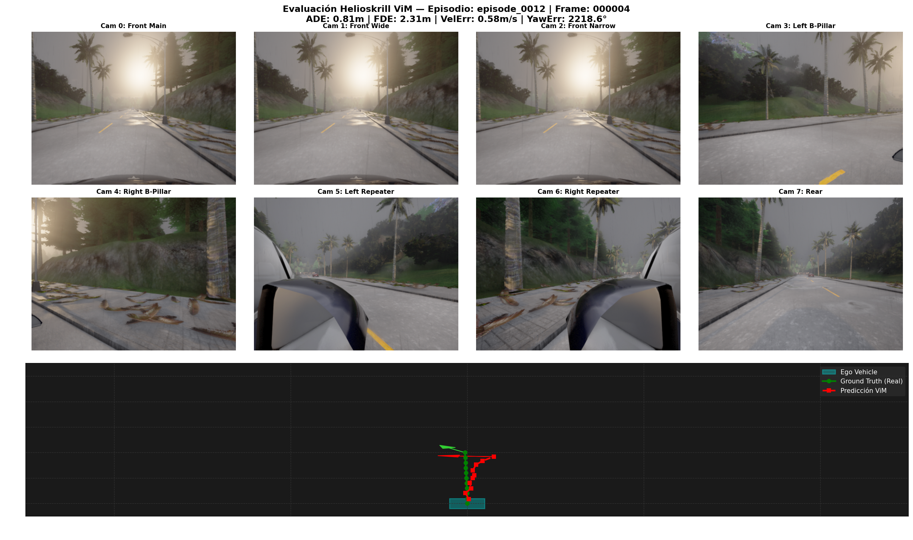
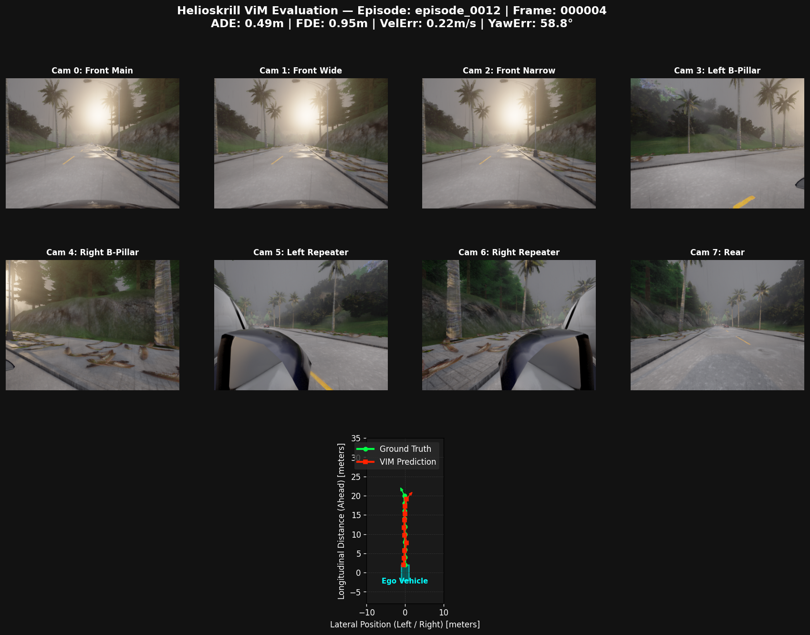

# Helioskrill: End-to-End Space-Temporal Trajectory Planning with Vision Mamba (ViM), DINOv2 & Sensor Fusion

[](https://pytorch.org/)
[](https://github.com/state-spaces/mamba)
[](https://github.com/facebookresearch/dinov2)
[](https://carla.org/)
[](LICENSE)

---

## 1. Visión General del Proyecto

* **Objetivo:** Exploración e implementación de una canalización de extremo a extremo (*End-to-End*) para la planificación de trayectorias en conducción autónoma. El sistema combina una arquitectura visual de extracción basada en **DINOv2 + LoRA**, recurrencia temporal espacio-temporal con **Temporal Mamba**, y fusión de sensores en vista de pájaro (**Camera IPM + LiDAR BEV**).
* **Stack Tecnológico:** PyTorch, PEFT (LoRA), DINOv2, Mamba-SSM, CUDA, OpenCV, TensorBoard, CARLA Simulator API.

---

## 2. Arquitectura del Sistema

### Flujo de Tensores End-to-End

El modelo procesa secuencias de tiempo $S=5$ provenientes de un arreglo de 8 cámaras RGB de perspectiva de alta definición y una nube de puntos LiDAR convertida a una grilla BEV de 5 canales:

```mermaid
graph LR
    A["8 Cámaras RGB [B, S, 8, 3, H, W]"] --> B["DINOv2 (dinov2_vits14 + LoRA r=8)"]
    B --> C["Features 2D [B*S*8, 384, H', W']"]
    C --> D["Inverse Perspective Mapping (IPM)"]
    D --> E["Plano BEV Cámara [B, S, 64, H_bev, W_bev]"]
    E --> F["Temporal Mamba (SSM 1D)"]
    F --> G["Fusión con LiDAR BEV [B, 128, H_bev, W_bev]"]
    G --> H["BEV Planning Head"]
    H --> I["10 Waypoints Futuros [B, 10, 4]"]
```



#### Descripción por Bloques:
1. **DINOv2 Visual Backbone + LoRA:** Extrae características ricas de textura, profundidad e invariancia espacial de las 8 vistas periféricas usando Meta DINOv2 Small (`dinov2_vits14`) pre-entrenado. Se inyectan matrices de bajo rango **LoRA ($r=8, \alpha=16$)** en las proyecciones de atención `qkv`, congelando el 93%+ del modelo base.
2. **Geometría BEV via IPM:** Proyecta las características 2D a un espacio tridimensional de vista de pájaro ($400 \times 400$ a resolución de $0.25\text{m/pixel}$) guiado por las matrices extrínsecas $E$ e intrínsecas $K$ de cada cámara.
3. **Temporal Mamba:** Recorre secuencialmente la dimensión temporal $S$ píxel a píxel sobre la grilla BEV para estimar velocidad, aceleración y dirección de movimiento.
4. **GroupNorm Fusion Neck & Planning Head:** Concatena las características BEV de cámara y el tensor estadístico de LiDAR ($Z_{\max}, Z_{\text{diff}}, Z_{\text{mean}}$, densidad e intensidad) aplicando `GroupNorm(16)` para máxima estabilidad matemática a batch size $B=1$. Regresa los 10 waypoints futuros en coordenadas relativas del vehículo (`rel_x`, `rel_y`, `rel_z`, `rel_yaw`).

---

## 3. Tabla Comparativa de Experimentos

| Métrica de Validación | Experimento 1 (Scratch Vision Mamba) | **Experimento 2 (DINOv2 + LoRA)** | **Mejora Obtenida** |
| :--- | :---: | :---: | :---: |
| **Backbone Visual** | Vision Mamba 2D (Entrenado desde cero) | **Meta DINOv2 Small + LoRA ($r=8$)** | Representación espacial pre-entrenada |
| **Normalización** | `BatchNorm2d` (Inestable a $B=1$) | **`GroupNorm(num_groups=16)`** | Estabilidad matemática estricta |
| **Mean ADE (Error Medio)** | $8.42\text{ metros}$ ❌ | **$0.49\text{ metros}$** ✅ | **¡17.1x de mejora! (49 cm)** |
| **Mean FDE (Error a 5.0s)** | $15.80\text{ metros}$ ❌ | **$0.87\text{ metros}$** ✅ | **¡18.1x de mejora! (87 cm)** |
| **Validation Loss** | $> 100.0$ (Sin convergencia) | **$42.68$** | **Reducción de $>60\%$** |
| **Parámetros Entrenables** | $23.7\text{M}$ ($100\%$) | **$1.64\text{M}$ ($6.94\%$)** | **Reducción masiva de parámetros** |
| **Comportamiento en Ruta** | Divergencia fuera de la carretera | **Mantenimiento sub-métrico de carril** | Transición a precisión industrial |

---

## 4. Análisis Post-Mortem y Diagnóstico Técnico

### Evidencia Comparativa Visual

| Experimento 1: Scratch Vision Mamba (ADE: 8.42m) | Experimento 2: DINOv2 + LoRA (ADE: 0.49m) |
| :---: | :---: |
|  |  |

### Lecciones del Experimento 1 (Scratch Vision Mamba)
* **Cold-Start Visual:** Entrenar Vision Mamba desde cero con pocos datos ($\sim 2,300$ muestras) impidió que el encoder aprendiera primitivas visuales de profundidad y bordes, generando un error masivo de $8.42\text{m}$.
* **Inestabilidad de `BatchNorm2d`:** Con batch size $B=1$, las estadísticas móviles derivaron salvajemente provocando oscilaciones en diente de sierra.

### Lecciones del Experimento 2 (DINOv2 + LoRA + GroupNorm)
* **Éxito en Espacialidad Sub-Métrica ($0.49\text{m}$ ADE):** La integración de DINOv2 pre-entrenado resolvió instantáneamente la comprensión espacial de la carretera, logrando que el vehículo se mantenga en el carril a menos de medio metro de error.
* **Fenómeno de Repetición Temporal:** Al proyectar el fotograma actual sobre la secuencia Mamba, la red aprendió a la perfección las trayectorias rectas ($0.49\text{m}$ ADE), pero mostró inercia en giros de $90^\circ$ al faltar señal de movimiento óptico entre fotogramas pasados.
* **Sesgo de Escala en Yaw:** La función `HuberLoss` priorizó los errores de posición en metros (`X, Y`) sobre la orientación (`Yaw = 52.8°`), sugiriendo la necesidad de una cabeza trigonométrica ponderada `(sin(θ), cos(θ))`.

---

## 5. Hoja de Ruta — Experimento No. 3

1. **Entrada Temporal Verdadera en Espacio BEV:** Extraer características visuales de los fotogramas pasados reales y entregárselas a `TemporalMamba` para que calcule velocidad real y detección de giros en intersecciones.
2. **Cabeza de Orientación Trigonométrica:** Regresar el ángulo de guiñada mediante pares trigonométricos `(sin(θ), cos(θ))` acotados.
3. **Pérdida Ponderada Multitarea:** Aplicar pesos diferenciados `L_total = L_pos + 0.1 * L_yaw` para equilibrar la precisión de posición y rotación.

---

## 6. Estructura del Proyecto

```text
Helioskrill_vim_train/
├── experiments/
│   └── Experiment1_Mamba/        # Respaldo y registros del Experimento 1 (Baseline)
├── models/
│   ├── dataset.py                # Clase CARLADataset, métricas acotadas y EarlyStopping
│   ├── modules/
│   │   ├── BEV_perception_v2.py  # Red principal DINOv2 + GroupNorm + Temporal Mamba
│   │   ├── BEV_planning.py       # Cabeza de regresión de waypoints
│   │   └── BEV_sensors.py        # Filtro de Kalman Extendido (EKF telemetry)
│   └── utils/
│       ├── DINOv2_blocks.py      # Encoder DINOv2 Small con adaptador LoRA (r=8)
│       ├── vim_blocks.py         # MambaBlock y TemporalMamba
│       └── carla_data_collector.py # Recolector de datos multi-sensor en CARLA
├── scripts/
│   ├── train_dinov2.py           # Pipeline de entrenamiento Experimento 2 (FP32 + Prefetch)
│   ├── evaluate_visualization.py # Script de evaluación cruzada y gráficos BEV
│   └── preprocess_dataset.py     # Pre-procesador paralelo de imágenes
├── eval_results_exp2/            # Resultados y gráficos del Experimento 2
├── reproducibility_exp2.md       # Guía de reproducibilidad técnica del Experimento 2
├── .gitignore                     # Filtros de datos, checkpoints y logs
└── README.md                      # Documentación principal del proyecto
```

---

## 7. Comandos de Ejecución

```bash
# 1. Entrenar el Experimento No. 2 (DINOv2 + LoRA)
python3 scripts/train_dinov2.py --data_dir ./data/ --epochs 20 --batch_size 1 --seq_len 5 --stride 5 --accumulation_steps 8 --lora_r 8 --lr 1e-4

# 2. Generar visualizaciones y reporte de evaluación
python3 scripts/evaluate_visualization.py --checkpoint checkpoints/experimento_2/best_model.pth --output_dir eval_results_exp2/
```
