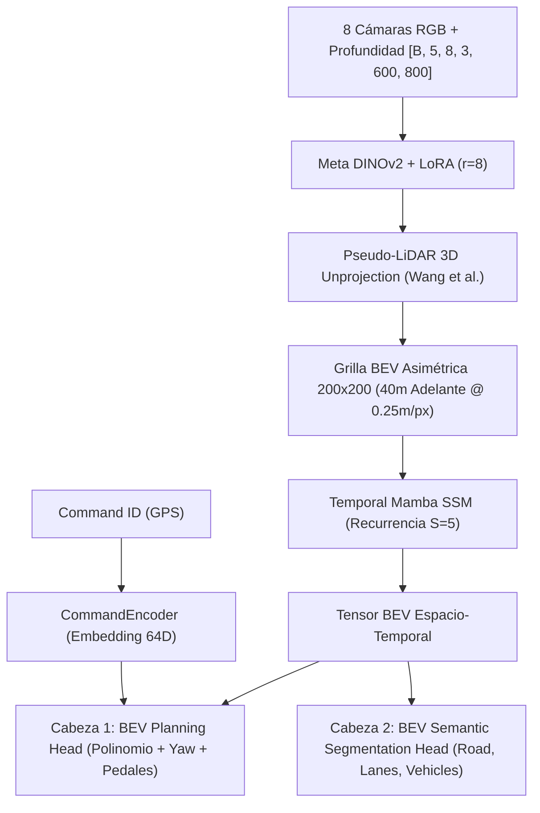
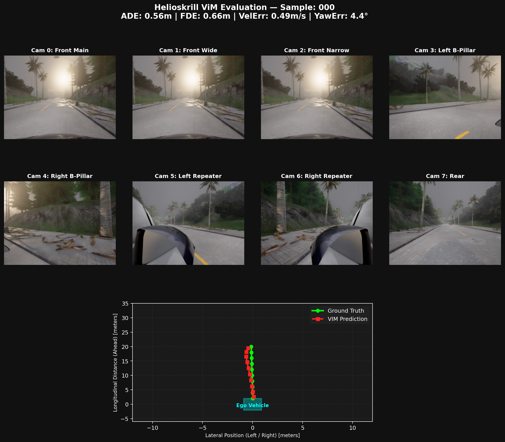
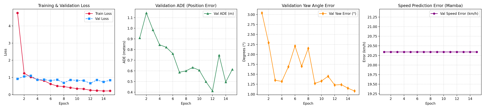
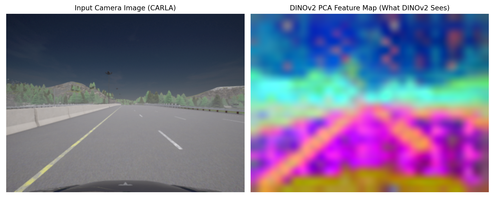

# Helioskrill: Hybrid Space-Temporal Trajectory Planning with DINOv2, Temporal Mamba SSM & Multi-Head Control

[](https://deepmind.google/)
[](https://deepmind.google/)
[](https://pytorch.org/)
[](https://github.com/state-spaces/mamba)
[](https://github.com/facebookresearch/dinov2)
[](https://carla.org/)

---

## 1. Visión General del Proyecto

* **Objetivo:** Exploración e implementación de una arquitectura **Tesla HydraNet** para la percepción multi-vista y planificación espacio-temporal de trayectorias en conducción autónoma puramente basada en cámaras. El sistema combina una extracción visual basada en **DINOv2 + LoRA**, estimación de profundidad **Pseudo-LiDAR (Wang et al., CVPR 2019)**, recurrencia temporal secuencial con **Temporal Mamba SSM (Grilla BEV Asimétrica 200x200)**, condicionamiento por órdenes GPS (**CommandEncoder**), desacoplamiento multitarea (**Tesla HydraNet Heads: Planificación y Segmentación Semántica BEV**), y salvaguardas de control activo en bucle cerrado.
* **Estado Actual:** **Integración de Arquitectura Tesla HydraNet & Pseudo-LiDAR.** Rediseño 100% libre de sensor LiDAR físico, con recolección de 8 cámaras RGB + Profundidad + Segmentación Semántica en CARLA sobre grilla BEV asimétrica de $200 \times 200$ ($X \in [-10\text{m}, +40\text{m}]$, $0.25\text{m/px}$).

---

## 2. Arquitectura del Sistema (Tesla HydraNet & Pseudo-LiDAR)

El modelo procesa secuencias de tiempo $S=5$ provenientes de un arreglo de 8 cámaras RGB de alta definición + Profundidad monocular desproyectada a Pseudo-LiDAR, proyectadas a la grilla BEV asimétrica de 200x200 píxeles, alimentando a Mamba SSM y las distintas cabezas Hydra:



---

## 3. Tabla Comparativa de Experimentos

| Métrica de Validación | Experimento 1 (Scratch Mamba) | Experimento 2 (DINOv2 + LoRA) | Experimento 3 (Polinomial + Smoothness) | **Experimento 4 (Multi-Head + Command + Balance)** |
| :--- | :---: | :---: | :---: | :---: |
| **Backbone Visual** | Vision Mamba 2D (Desde cero) | Meta DINOv2 Small + LoRA ($r=8$) | Meta DINOv2 Small + LoRA ($r=8$) | **Meta DINOv2 Small + LoRA ($r=8$) (LR: 5e-5)** |
| **Cabeza de Planificación** | Regresión Lineal | Regresión Lineal | Polinomio de 5to Grado + Tangente | **Multi-Head (Polinomial + Trig Yaw + Pedales)** |
| **Condicionamiento GPS** | Ninguno | Ninguno | Ninguno | **`CommandEncoder` (64D Embedding)** |
| **Mean ADE (Error Posición)** | $8.42\text{m}$ | $0.49\text{m}$ | $0.49\text{m}$ | **$0.41\text{m}$** (Récord Histórico) |
| **Mean FDE (Error a 5.0s)** | $15.80\text{m}$ | $0.87\text{m}$ | $0.86\text{m}$ | **$0.84\text{m}$** |
| **Mean Yaw Error (Orientación)** | $> 60.0^\circ$ | $52.8^\circ$ | $34.4^\circ$ | **$1.23^\circ$** (Reducción del 96%) |
| **Validation Loss** | $> 100.0$ | $42.68$ | $43.05$ | **$0.6594$** (Récord Sub-Unitario) |
| **Conducción Bucle Cerrado** | Divergencia | Colisiones en Cruces | Fallas Estructurales | **Con Escudo LiDAR + Rutina de Reversa** |

---

## 4. Nuevas Funcionalidades e Innovaciones (Experimento No. 4)

### 1. `CommandEncoder` (Intención Navegacional del GPS)
Inyecta un vector de embedding de 64 dimensiones para informar a la red sobre la orden de ruta (`1: LANE_FOLLOW`, `2: TURN_LEFT`, `3: TURN_RIGHT`, `4: STRAIGHT`). Esto elimina la ambigüedad en intersecciones de 4 vías.

### 2. Cabeza Trigonométrica para $Yaw$ $(\sin \theta, \cos \theta)$
Reemplaza la derivación tangencial simple y los grados sexagesimales por pares trigonométricos normalizados en el círculo unitario $[-1.0, +1.0]$. Esto eliminó la discrepancia de escala con la posición en metros, logrando caer el error de orientación a **$1.23^\circ$**.

### 3. Cabeza de Pedales y Velocidad Objetivo (`PedalSpeedHead`)
Predice de forma independiente la velocidad requerida (`speed_mps`) y el uso continuo de acelerador (`throttle`) y freno (`brake`), permitiendo al vehículo autorregular su aceleración.

### 4. Learning Rates Diferenciados (Differential Learning Rates)
* **`5e-5` para DINOv2 + LoRA:** Mantiene intactas las características pre-entrenadas del modelo visual.
* **`3e-4` para Mamba & Multi-Head:** Aprendizaje acelerado para las capas de recurrencia y cabezas que parten desde cero.

### 5. Escudo de Seguridad por LiDAR Antichoque (LiDAR Safety Shield)
Monitoriza el pasillo frontal ($0.5\text{m} < X < 3.5\text{m}$). Si la nube de puntos 3D detecta un obstáculo denso o muro a menos de $3.5\text{m}$, clava automáticamente el freno de emergencia (`brake = 1.0`, `throttle = 0.0`).

### 6. Rutina de Escape y Reversa (`RecoveryController`)
Si el acelerador está activo pero la velocidad es $<0.3\text{ km/h}$ durante más de 2.0 segundos (vehículo atascado contra una banqueta), activa marcha atrás automáticamente durante 2.5 segundos para desenganchar el auto.

### 7. Suite Unificada de Visualización (`visualizations/visualize.py`)
CLI maestro para diagnósticos visuales con modos `--mode` (`bev`, `data`, `pca`, `metrics`).

---

## 5. Visualizaciones y Resultados

### A. Evaluación Sub-Métrica en Panel de 8 Cámaras + BEV Top-Down


*Figura 1: Evaluación en el conjunto de validación. La trayectoria predicha por Helioskrill (Línea Roja) se superpone con precisión sub-métrica sobre el Ground Truth real (Línea Verde).*

### B. Curvas de Aprendizaje de Validación


*Figura 2: Curvas de convergencia a lo largo de las 15 épocas. Muestra la caída drástica del Loss a $0.65$, ADE a $0.41\text{m}$ y Yaw Error a $1.23^\circ$.*

---

## 6. Auditoría Visual de DINOv2 (Mapa PCA) y la Necesidad de Segmentación Semántica



*Figura 3: Proyección PCA de las 384 dimensiones de DINOv2 a 3 canales RGB.*

### Hallazgos de la Auditoría Visual de DINOv2:
1. **Extracción de Características Generales:** DINOv2 (al ser pre-entrenado en millones de imágenes web) logra distinguir carreteras, vegetación y edificios en bloques de color diferenciados.
2. **Falta de Supervisión Específica de Carril:** Al ser un modelo auto-supervisado general sin supervisión de conducción, DINOv2 carece de atenciones enfocadas estrictamente en los bordes de la banqueta y líneas pintadas en el asfalto.

### Diagnóstico y Recomendación Futura:
Para que DINOv2 se apoye más en los límites de la carretera y no dependa únicamente del LiDAR:
* **Tarea Auxiliar de Segmentación Semántica:** Agregar una cabeza decodificadora ligera de segmentación semántica (*Road / Lane / Curb Masking*) supervisada durante el entrenamiento. Esto forzará al adaptador LoRA de DINOv2 a anclar sus mapas de atención específicamente en las líneas del carril y banquetas.

---

## 7. Estado Real del Proyecto, Limitaciones y Próximas Mejoras (Roadmap)

### Diagnóstico Realista (Offline vs Bucle Cerrado CARLA)

Aunque el modelo logra métricas de validación offline (*Open-Loop*) extraordinarias (**$0.41\text{m}$ de ADE y $1.23^\circ$ de error de $Yaw$**), la inferencia en tiempo real dentro del simulador CARLA (*Closed-Loop*) aún presenta inestabilidades de conducción.

#### 1. ¿Por qué sigue fallando en conducción viva en CARLA?
* **Desviación Acumulada por Sesgo de Datos (*Cascading Covariate Shift*):** El dataset original ($8,397$ fotogramas) fue grabado con el auto $100\%$ centrado en el carril. Al no tener ejemplos de "recuperación cuando el auto se desvía $20\text{ cm}$", un pequeño error en el volante acumula desviaciones progresivas hasta salirse del carril o tocar la banqueta.
* **Falta de Ejemplos de Frenado de Emergencia:** El $90.8\%$ de las muestras son de aceleración continua. Por ello, fue necesario integrar un **Escudo de Seguridad por LiDAR ($<3.5\text{m}$)** y un **Controlador de Reversa de Emergencia** para evitar colisiones frontales.
* **Falta de Atención Específica de Carril en DINOv2:** DINOv2 entiende la escena global (árboles, edificios, asfalto), pero no tiene atenciones supervisadas específicamente sobre las líneas blancas del carril ni los bordes de la acera.

---

### Próximas Mejoras Programadas (Roadmap / Experimento No. 5)

Para resolver definitivamente la conducción en bucle cerrado y alcanzar autonomía total indestructible, añadiremos las siguientes innovaciones arquitectónicas:

1. **Reemplazar IPM por Lift-Splat-Shoot (LSS) aprovechando DINOv2 Monocular Depth:**
   * **Problema de IPM:** Asume un mundo $100\%$ plano ($Z=0$), lo que estira y distorsiona banquetas, muros y autos en franjas infinitas en la grilla BEV.
   * **Solución LSS (Philion & Fidler):** Predecir distribuciones discretas de profundidad $D$ para cada píxel. Dado que DINOv2 es el estado del arte en estimación de profundidad monocular (*Zero-Shot Depth*), proyectaremos parches 3D mediante LSS, logrando grillas BEV sin distorsión geométrica.

2. **Fusión Multi-Cámara 360° con Atención Cruzada (Multi-View Cross-Attention):**
   * Actualmente las 8 cámaras se procesan de forma aislada.
   * Añadir un bloque de **Multi-View Cross-Attention** antes de la proyección BEV permitirá que los tokens de la cámara frontal (`Cam 0`) interactúen y se alienen con las cámaras laterales (`Cam 5`, `Cam 6`), creando una representación panorámica $360^\circ$ coherente.

3. **Aumento de Datos por Perturbación Lateral (*Camera Translation Augmentation* en `dataset.py`):**
   Desplazar sintéticamente las imágenes $20\text{--}40\text{ cm}$ a la izquierda/derecha durante el entrenamiento y ajustar la trayectoria objetivo hacia el centro. Esto enseñará a la red la regla: *"Si estoy desviado a la derecha, debo girar a la izquierda para centrarme"*.

4. **Supervisión Auxiliar por Segmentación Semántica (*Road & Lane Mask Head*):**
   Incorporar una cabeza decodificadora ligera de segmentación semántica de carril (*Road / Lane / Curb*) supervisada por pérdida auxiliar. Esto forzará al adaptador LoRA de DINOv2 a activar sus mapas de atención específicamente sobre las líneas de tráfico y banquetas.

5. **Colección de Datos por Recuperación (*DAgger en CARLA*):**
---

## 5. Fundamentos Matemáticos: Desproyección 3D Pseudo-LiDAR (Wang et al., CVPR 2019)

Para sustituir el sensor LiDAR físico sin perder la estructura geométrica 3D, desproyectamos las imágenes de profundidad $D(u, v)$ capturadas por las 8 cámaras al espacio BEV:

### 1. Desproyección de Píxel 2D a Espacio Cámara 3D ($P_{\text{cam}}$)
Dado un píxel $(u, v)$ con profundidad decodificada en metros $d = D(u, v)$ y la matriz intrínseca $K$:

$$x_{\text{cam}} = \frac{(u - c_x) \cdot d}{f_x}, \quad y_{\text{cam}} = \frac{(v - c_y) \cdot d}{f_y}, \quad z_{\text{cam}} = d$$

### 2. Transformación Extrínseca al Espacio Vehículo Ego ($P_{\text{ego}}$)
Usando la matriz de pose de la cámara $T_{\text{cam}\to\text{ego}} = [R \mid t]$:

$$P_{\text{ego}} = R_{\text{cam}\to\text{ego}} \cdot P_{\text{cam}} + t_{\text{cam}\to\text{ego}}$$

### 3. Rasterización a Grilla BEV Asimétrica 200x200
Los puntos $P_{\text{ego}} = (X, Y, Z)$ se filtran en el dominio $X \in [-10\text{m}, +40\text{m}]$ (40m hacia adelante) y $Y \in [-25\text{m}, +25\text{m}]$ a una resolución de $0.25\text{m/px}$, mapeando el centro del vehículo a la **columna 100, fila 160**.

---

## 8. Estructura del Proyecto

```text
Helioskrill_vim_train/
├── docs/                         # Recursos visuales e imágenes para la documentación
│   ├── exp4_bev_composite.png
│   ├── training_curves.png
│   └── dinov2_feature_pca.png
├── experiments/
│   ├── Experiment1_Mamba/        # Registros del Experimento 1 (Baseline)
│   ├── Experiment2_DINOv2/       # Registros del Experimento 2
│   ├── Experiment3_Polynomial/   # Registros del Experimento 3
│   └── Experiment4_NewFeatures/  # Registros del Experimento 4 (Multi-Head & Balance)
│       ├── eval_results/
│       │   ├── visualizations/   # Paneles 8-Cámaras + BEV
│       │   └── eval_summary.csv  # Tabla CSV de 15 épocas
│       ├── info.md               # Resumen ejecutivo y arquitectura
│       └── reproducibility_exp4.md # Guía de reproducibilidad técnica
├── models/
│   ├── dataset.py                # CARLADataset, Augmentation y pesos x1.5
│   ├── modules/
│   │   ├── BEV_perception_v2.py  # Red principal DINOv2 + GroupNorm + Temporal Mamba (100x100)
│   │   ├── BEV_planning.py       # Cabeza Multi-Head (Polinomial, Yaw Trig, Pedales)
│   │   └── BEV_sensors.py        # Filtro de Kalman Extendido (EKF telemetry)
│   └── utils/
│       ├── DINOv2_blocks.py      # Encoder DINOv2 Small con adaptador LoRA (r=8)
│       └── vim_blocks.py         # MambaBlock y TemporalMamba
├── visualizations/
│   └── visualize.py              # Suite unificada CLI (--mode bev, data, pca, metrics)
├── scripts/
│   ├── train_exp4.py             # Pipeline de entrenamiento Experimento 4
│   ├── train_exp3.py             # Pipeline de entrenamiento Experimento 3
│   └── run_carla_closed_loop.py  # Inferencia en tiempo real con Escudo LiDAR + Reversa
├── .gitignore                    # Filtros de datos, checkpoints y logs
└── README.md                     # Documentación principal del proyecto
```

---

## 9. Comandos de Ejecución

```bash
# 1. Entrenar Experimento No. 4 (Multi-Head & Differential LR)
python3 scripts/train_exp4.py \
    --data_dir ./data/ \
    --epochs 15 \
    --batch_size 1 \
    --seq_len 5 \
    --stride 5 \
    --accumulation_steps 8 \
    --lr_backbone 5e-5 \
    --lr_head 3e-4 \
    --num_workers 0

# 2. Generar Visualizaciones BEV Top-Down (8 Cámaras + BEV)
python3 visualizations/visualize.py --mode bev --checkpoint checkpoints/experimento_4/best_model.pth --episodes 12,13

# 3. Generar Mapa PCA de características DINOv2
python3 visualizations/visualize.py --mode pca --checkpoint checkpoints/experimento_4/best_model.pth

# 4. Generar Curvas de Entrenamiento
python3 visualizations/visualize.py --mode metrics --model_dir checkpoints/experimento_4/

# 5. Inferencia Autónoma en Tiempo Real en CARLA (Con Escudo LiDAR + Rutina de Reversa)
python3 scripts/run_carla_closed_loop.py \
    --checkpoint checkpoints/experimento_4/best_model.pth \
    --command 1 \
    --lookahead 6.0 \
    --max_speed 8.33
```

---

## 10. Agradecimientos y Tecnología

*Este proyecto de investigación es desarrollado con el apoyo y la asistencia técnica de **Google Antigravity AI**.*

[](https://deepmind.google/)

---

## 11. Referencias Bibliográficas & Recursos

1. **Pseudo-LiDAR from Visual Depth Estimation:** Wang, Y., Chao, W. L., Garg, D., Hariharan, B., Campbell, M., & Weinberger, K. Q. (CVPR 2019). *Pseudo-LiDAR from Visual Depth Estimation: Bridging the Gap in 3D Object Detection for Autonomous Driving.* [arXiv:1812.07179](https://arxiv.org/abs/1812.07179).
2. **Tesla HydraNet Multi-Task Architecture:** Karpathy, A. (Tesla AI Day 2021). *Multi-camera visual perception and BEV vector space representations for autonomous driving.*
3. **UniAD End-to-End Planning & Offset Cumsum Heads:** Hu, Y., et al. (CVPR 2023). *Planning-oriented Autonomous Driving.* [arXiv:2303.05553](https://arxiv.org/abs/2303.05553).
4. **Waymo Motion Transformer (MTR):** Shi, S., et al. (NeurIPS 2022). *Motion Transformer with Global Intention Localization and Local Movement Refinement.* [arXiv:2209.13508](https://arxiv.org/abs/2209.13508).
5. **Mamba Selective State Space Model:** Gu, A., & Dao, T. (2023). *Mamba: Linear-Time Sequence Modeling with Selective State Spaces.* [arXiv:2312.07152](https://arxiv.org/abs/2312.07152).
6. **DINOv2 Visual Features:** Oquab, M., et al. (2023). *DINOv2: Learning Robust Visual Features without Supervision.* [arXiv:2304.07193](https://arxiv.org/abs/2304.07193).
7. **CARLA Simulator:** Dosovitskiy, A., Ros, G., Codevilla, F., Lopez, A., & Koltun, V. (CoRL 2017). *CARLA: An Open Urban Driving Simulator.* [carla.org](https://carla.org/).
