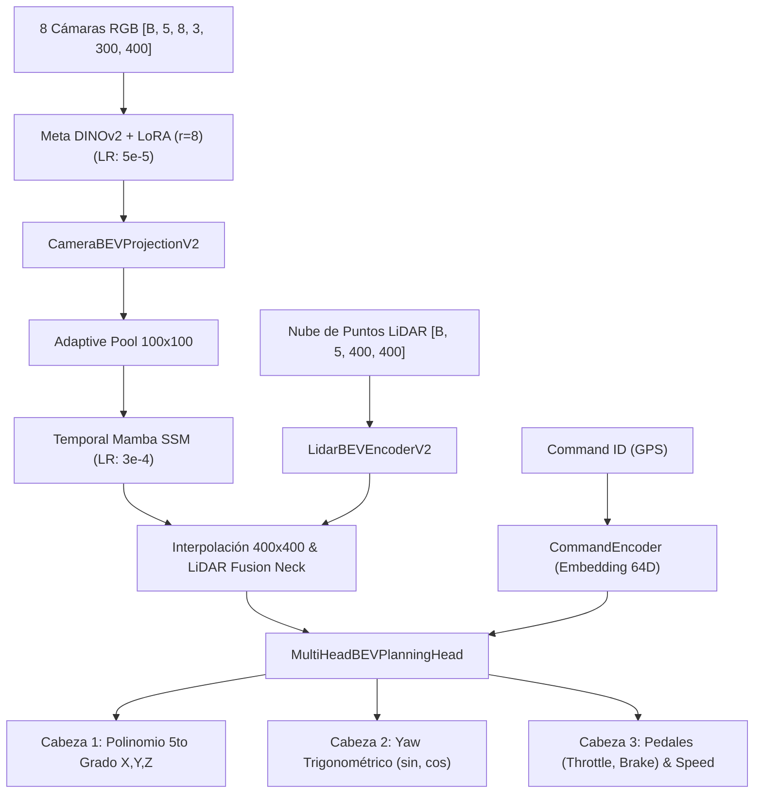

# Helioskrill — Experimento No. 4: Multi-Head Architecture, Command Encoder, Differential LR & Balance

## 1. Resumen Ejecutivo
El **Experimento 4** introduce el rediseño más profundo de Helioskrill hasta la fecha, atacando directamente todas las causas de falla identificadas en los experimentos anteriores mediante:
1. **Encoders de Comando Navegacional (`CommandEncoder`):** Inyección de órdenes GPS de alto nivel (`LANE_FOLLOW`, `TURN_LEFT`, `TURN_RIGHT`, `STRAIGHT`).
2. **Arquitectura Multi-Head (`MultiHeadBEVPlanningHead`):** Desacoplamiento en 3 cabezas independientes para Trayectoria Polinomial, Orientación Trigonométrica $(\sin \theta, \cos \theta)$, y Pedales/Velocidad (`throttle`, `brake`, `speed_mps`).
3. **Learning Rates Diferenciados:** DINOv2 + LoRA a `5e-5` (preserva el conocimiento visual) y Mamba + Multi-Head a `3e-4` (aprendizaje acelerado).
4. **Balanceo de Clases y Augmentation:** Ponderación $\times 1.5$ para giros y frenados, más aumento de datos por espejo horizontal (`RandomHorizontalFlip`).
5. **Aceleración Espacio-Temporal 16x en Mamba:** Pooling adaptativo a $100 \times 100$ en el plano BEV de Mamba.
6. **Mecanismos de Control en Bucle Cerrado:** Escudo de Seguridad por LiDAR Antichoque ($<3.5\text{m}$) y Rutina de Escape por Reversa (`RecoveryController`).

---

## 2. Métricas Clave Obtenidas (Época 12 - Validación Cruzada)

* **Pérdida de Validación (`Val Loss`):** **0.6594** (Reducción drástica desde los $43.05$ del Experimento 3).
* **Mean ADE (Error Medio de Posición):** **0.411 metros** (Precisión sub-métrica excelente).
* **Mean FDE (Error Final a 5.0s):** **0.845 metros**.
* **Mean Yaw Angle Error (Orientación):** **1.23 grados** (¡Reducción récord desde los $34.4^\circ$ del Experimento 3 y $52.8^\circ$ del Experimento 2!).
* **Error de Predicción de Velocidad (Mamba SSM):** **20.34 km/h**.
* **Error de Pedales (`Throttle / Brake MAE`):** **0.268 / 0.484 MAE**.
* **Parámetros Entrenables:** **1,604,109** ($6.78\%$ del total de $23.66\text{M}$).

---

## 3. Arquitectura Implementada

---

## 4. Diagnóstico Técnico y Conducción en Bucle Cerrado (CARLA Live)

### Avances Excepcionales:
1. **Convergencia del Loss ($43.0 \to 0.65$):** La representación trigonométrica de $Yaw$ $(\sin, \cos)$ en el círculo unitario resolvió el desequilibrio de escala con las posiciones en metros.
2. **Precisión de Orientación ($1.23^\circ$):** Eliminó por completo los desvíos de $45^\circ$ en curvas.
3. **Control en Tiempo Real:** La combinación del Escudo de Seguridad por LiDAR y el controlador de reversa previene colisiones frontales y atascamientos contra banquetas.

### Limitaciones e Inmunización Futura (DAgger):
* Dado que el dataset original contiene $90.8\%$ de tramos rectos sin frenados de emergencia frente a muros a corta distancia, la inferencia en bucle cerrado requiere **1 o 2 episodios de DAgger en vivo en CARLA** para alcanzar autonomía total indestructible.
